## 文献整理
### 要求

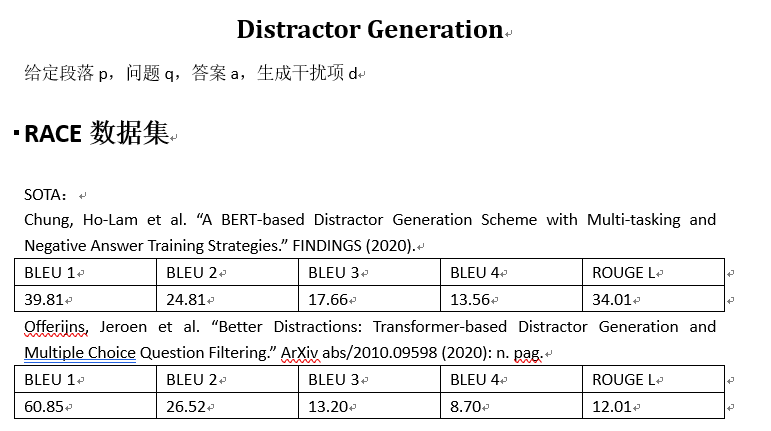

### 搜集到相关文献标题和地址
- [A BERT-based Distractor Generation Scheme with Multi-tasking and Negative Answer Training Strategies](https://arxiv.org/pdf/2010.05384.pdf)  
- [Better Distractions: Transformer-based Distractor Generation and Multiple Choice Question Filtering](https://arxiv.org/pdf/2010.09598.pdf)  
- [Generating Distractors for Reading Comprehension Questions from Real Examinations](https://ojs.aaai.org//index.php/AAAI/article/view/4606)
- [Co-attention hierarchical network: Generating coherent long distractors for reading comprehension](https://ojs.aaai.org/index.php/AAAI/article/view/6522) 
- [Automatic Distractor Generation for Multiple Choice Questions in Standard Tests](https://aclanthology.org/2020.coling-main.189.pdf)  
- [Distractor Generation for Multiple Choice Questions Using Learning to Rank](https://aclanthology.org/W18-0533.pdf)  
- [Knowledge-Driven Distractor Generation for Cloze-style Multiple Choice Questions](https://ojs.aaai.org/index.php/AAAI/article/view/16559)  

# 第一篇
### Title
A BERT-based Distractor Generation Scheme with Multi-tasking and
Negative Answer Training Strategies
### Author
Ho-Lam Chung, Ying-Hong Chan, Yao-Chung Fan
### Abstract
现有的DG[^1]局限在只能生成一个误导选项，我们需要生成多个误导选项，文章中提到他们团队用multi-tasking和negative answer training技巧来生成多个误导选项，模型结果达到了学界顶尖。  

[^1]:distractor generation 误导选项生成，简称DG

### Introduction
DG效果不好，文章提出了两个提升的空间：  
1. DG质量提升：  
    BERT模型来提升误导选项质量
2. 多个误导选项生成：
    运用了覆盖的方法来选择distractor，而不是选择概率最高但是语义很相近的distractor

## BERT distractor generation
### 1)BERT-based distractor generation(BDG)
输入：段落P，答案A，问题Q，用C表示这三者concatenate后的结果。  
BDG模型是一个自回归模型，在预测阶段，每次输入C和上一次预测的词元，BDG迭代预测词元，直到预测出特殊词元\[S\]停止。下面这张图简单介绍了这个过程。

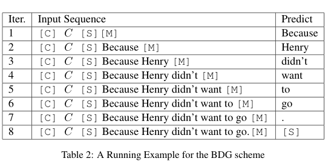

网络结构简单介绍：h[M]表示bert输出的隐藏状态，隐藏状态再输入到一个全连接层中用来预测词元。

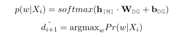

### 2)Multi-task with Parallel MLM
MLM全称masked language model，遮蔽语言模型,通过并行BDG和P-MLM来训练模型让模型有更好的效果。

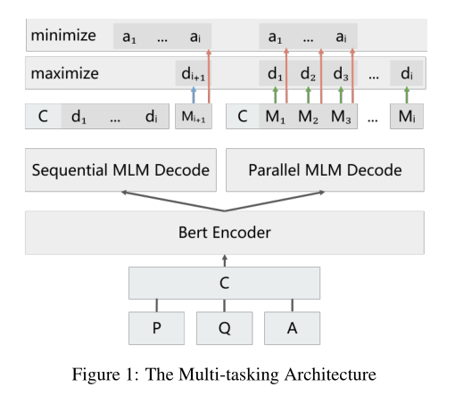

上图中左边的sequential MLM就是之前提到的BDG，BDG模型是一个词接一个词的预测，P-MLM是对所有的masked token进行预测，最后的损失函数是这两者相加[^2]，公式如下：

[^2]: 当我们test时，只需要Sequential MLM decoder来预测。

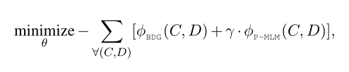

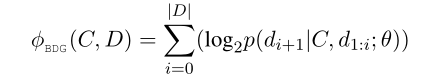

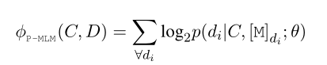

作者如此设计的思路是：BDG可能会忽略整体语义语义信息，但是会过拟合单个词预测。那么并行一个P-MLM可以防止过拟合。

### 3)Answer Negative Regularization
目前机器预测的distractor和answer有很高的相似度，下面一张表可以展示相似度。其中PM表示机器，Gold表示人工，作者将这类问题称为answer copying problem。

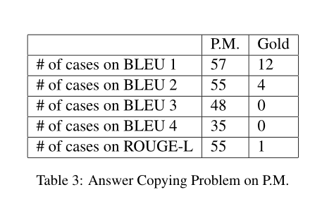

为了解决这个问题，作者提出了answer negative loss来让机器更多的选择与answer不同的词来表示新的distractor，公式如下：

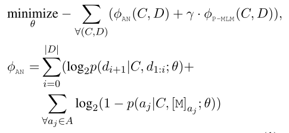

可以看出BDG的loss替换成了AN的loss，每一项都减去了Answer negative loss。

## Multiple Distractor Generation
### 1)Selecting Distractors by Entropy Maximization
选择语义不同的distractor set。文章借鉴了MRC[^3]的方法，让BDGmodel生成很多distractor组成 $\hat{D}$ = {$\hat{d}$1, $\hat{d}$2, $\hat{d}$3...}，然后找出最好的一组选项，一般情况下由三个误导选项和一个答案组成。选择的一句是最大化下面这个公式：

[^3]:multi-choice reading comprehension (MRC) model

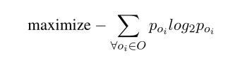

### 2)BDG-EM
我们可以通过不同的BDG模型来生成不同的误导选项最后组合，不同的模型区别是有没有answer negative/multi-task training，比如我们有这几个模型:$\hat{D}$,$\hat{D}$PM,$\hat{D}$PM+AN，它们分别代表含PM[^4]和含AN[^5]

[^4]:P-MLM

[^5]:Answer negative

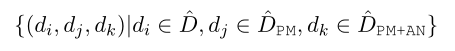

## Performance Evaluation
### 1)datasets
RACE,沿用了[Gao](https://ojs.aaai.org//index.php/AAAI/article/view/4606)那篇论文的处理,后面也会梳理那篇论文

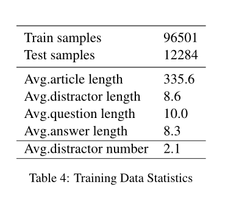

### 2)implementation details
- tokenizer: wordpiece tokenizer
- framewordk:huggingface trainsformers
- optimizer:adamW(lr:5e-5)
- github_url: [BDG](https://github.com/voidful/BDG)

### 3)compared methods
比较了不同的distractor generation
- CO-Att：出自[Zhou](https://ojs.aaai.org/index.php/AAAI/article/view/6522)
- DS-Att: 出自[Gao](https://ojs.aaai.org//index.php/AAAI/article/view/4606)
- GPT:baseline
- BDG: 没有应用P-MLM和Answer negative
- BDGPM
- BDGAN+PM

### 4)token score comparison
BLEU和ROUGE(L)两种判断指标

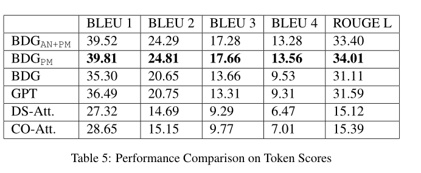

copying problem的效果

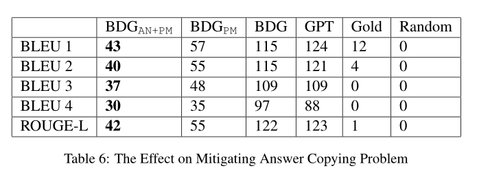

### 5)MCQ Model Accuracy Comparison
与回答系统相结合，将生成好的选项（一个正确答案三个误导选项）放入MCQ answering model，下面是回答正确率的表格

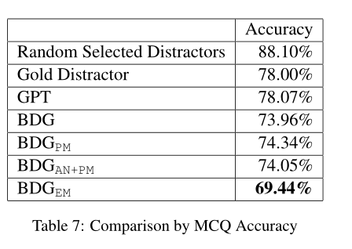

可以看出作者的模型选项的误导性还是很高的。

### 6）Parameter Study on γ
之前使用P-MLM并行训练时候有个权重参数γ，下表显示了不同γ值的影响，对于只有PM的模型来说，γ=6，对于既有AN和PM来说，γ=7

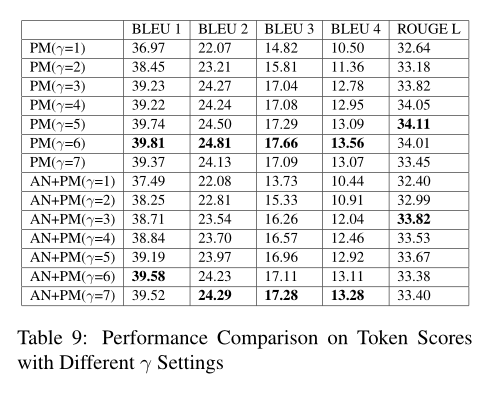

## Conclusion
现存的DG可以分为cloze-style distractor generation和 reading comprehension distractor generation，前者主要是word filling，后者主要看重语义信息，基于两者的设计出了很多模型，目前来看还是考虑语义信息生成的误导选项更好。

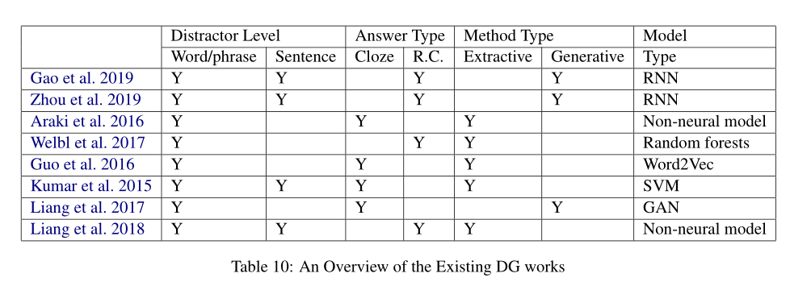

## 我的看法
文章中的模型提到了三种技术，第一是bert预训练模型使用。第二是P-MLM的并行使用， 它的使用让模型可以考虑段落的语义信息，那么生成的误导选项是sentence-level而不是之前模型所使用的类似word-filling这种word-level。第三是Answer negative loss的使用，它的使用相当于让模型不要考虑与正确答案语义很接近的误导选项，因为目前大多数DG生成多个选项时语义与正确答案都非常接近，这与实际情况不符，同时也起不到误导的作用。    
同时文章提出了生成多个误导选项时使用不同模型生成的误导选项拼在一起作为选项是一种比较好的解决方法，让一次性生成多个误导选型有了一定的可用性。  
文章的代码开源，可以去[github](https://github.com/voidful/BDG)上看训练细节和网络结构细节。

# 第二篇
### Title
Better Distractions: Transformer-based Distractor Generation and Multiple Choice Question Filtering
### Author
Jeroen Offerijns, Suzan Verberne, Tessa Verhoef
### Abstract

### Introduction

