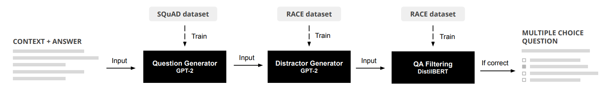
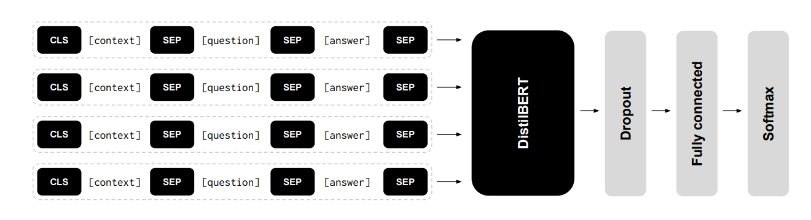

## 文献整理
### 要求

### 搜集到相关文献标题和地址
- [A BERT-based Distractor Generation Scheme with Multi-tasking and Negative Answer Training Strategies](https://arxiv.org/pdf/2010.05384.pdf)  
- [Better Distractions: Transformer-based Distractor Generation and Multiple Choice Question Filtering](https://arxiv.org/pdf/2010.09598.pdf)  
- [Generating Distractors for Reading Comprehension Questions from Real Examinations](https://ojs.aaai.org//index.php/AAAI/article/view/4606)
- [Co-attention hierarchical network: Generating coherent long distractors for reading comprehension](https://ojs.aaai.org/index.php/AAAI/article/view/6522) 
- [Automatic Distractor Generation for Multiple Choice Questions in Standard Tests](https://aclanthology.org/2020.coling-main.189.pdf)  
- [Distractor Generation for Multiple Choice Questions Using Learning to Rank](https://aclanthology.org/W18-0533.pdf)  
- [Knowledge-Driven Distractor Generation for Cloze-style Multiple Choice Questions](https://ojs.aaai.org/index.php/AAAI/article/view/16559)  

# 第一篇
### Title
A BERT-based Distractor Generation Scheme with Multi-tasking and
Negative Answer Training Strategies
### Author
Ho-Lam Chung, Ying-Hong Chan, Yao-Chung Fan
### Abstract
现有的DG[^1]局限在只能生成一个误导选项，我们需要生成多个误导选项，文章中提到他们团队用multi-tasking和negative answer training技巧来生成多个误导选项，模型结果达到了学界顶尖。  

[^1]:distractor generation 误导选项生成，简称DG

### Introduction
DG效果不好，文章提出了两个提升的空间：  
1. DG质量提升：  
    BERT模型来提升误导选项质量
2. 多个误导选项生成：
    运用了覆盖的方法来选择distractor，而不是选择概率最高但是语义很相近的distractor

## BERT distractor generation
### 1)BERT-based distractor generation(BDG)
输入：段落P，答案A，问题Q，用C表示这三者concatenate后的结果。  
BDG模型是一个自回归模型，在预测阶段，每次输入C和上一次预测的词元，BDG迭代预测词元，直到预测出特殊词元\[S\]停止。下面这张图简单介绍了这个过程。

网络结构简单介绍：h[M]表示bert输出的隐藏状态，隐藏状态再输入到一个全连接层中用来预测词元。

### 2)Multi-task with Parallel MLM
MLM全称masked language model，遮蔽语言模型,通过并行BDG和P-MLM来训练模型让模型有更好的效果。

上图中左边的sequential MLM就是之前提到的BDG，BDG模型是一个词接一个词的预测，P-MLM是对所有的masked token进行预测，最后的损失函数是这两者相加[^2]，公式如下：

[^2]: 当我们test时，只需要Sequential MLM decoder来预测。

作者如此设计的思路是：BDG可能会忽略整体语义语义信息，但是会过拟合单个词预测。那么并行一个P-MLM可以防止过拟合。

### 3)Answer Negative Regularization
目前机器预测的distractor和answer有很高的相似度，下面一张表可以展示相似度。其中PM表示机器，Gold表示人工，作者将这类问题称为answer copying problem。

为了解决这个问题，作者提出了answer negative loss来让机器更多的选择与answer不同的词来表示新的distractor，公式如下：

可以看出BDG的loss替换成了AN的loss，每一项都减去了Answer negative loss。

## Multiple Distractor Generation
### 1)Selecting Distractors by Entropy Maximization
选择语义不同的distractor set。文章借鉴了MRC[^3]的方法，让BDGmodel生成很多distractor组成 $\hat{D}$ = {$\hat{d}$1, $\hat{d}$2, $\hat{d}$3...}，然后找出最好的一组选项，一般情况下由三个误导选项和一个答案组成。选择的一句是最大化下面这个公式：

[^3]:multi-choice reading comprehension (MRC) model

### 2)BDG-EM
我们可以通过不同的BDG模型来生成不同的误导选项最后组合，不同的模型区别是有没有answer negative/multi-task training，比如我们有这几个模型:$\hat{D}$,$\hat{D}$PM,$\hat{D}$PM+AN，它们分别代表含PM[^4]和含AN[^5]

[^4]:P-MLM

[^5]:Answer negative

## Performance Evaluation
### 1)datasets
RACE,沿用了[Gao](https://ojs.aaai.org//index.php/AAAI/article/view/4606)那篇论文的处理,后面也会梳理那篇论文

### 2)implementation details
- tokenizer: wordpiece tokenizer
- framewordk:huggingface trainsformers
- optimizer:adamW(lr:5e-5)
- github_url: [BDG](https://github.com/voidful/BDG)

### 3)compared methods
比较了不同的distractor generation
- CO-Att：出自[Zhou](https://ojs.aaai.org/index.php/AAAI/article/view/6522)
- DS-Att: 出自[Gao](https://ojs.aaai.org//index.php/AAAI/article/view/4606)
- GPT:baseline
- BDG: 没有应用P-MLM和Answer negative
- BDGPM
- BDGAN+PM

### 4)token score comparison
BLEU和ROUGE(L)两种判断指标

copying problem的效果

### 5)MCQ Model Accuracy Comparison
与回答系统相结合，将生成好的选项（一个正确答案三个误导选项）放入MCQ answering model，下面是回答正确率的表格

可以看出作者的模型选项的误导性还是很高的。

### 6）Parameter Study on γ
之前使用P-MLM并行训练时候有个权重参数γ，下表显示了不同γ值的影响，对于只有PM的模型来说，γ=6，对于既有AN和PM来说，γ=7

## Conclusion
现存的DG可以分为cloze-style distractor generation和 reading comprehension distractor generation，前者主要是word filling，后者主要看重语义信息，基于两者的设计出了很多模型，目前来看还是考虑语义信息生成的误导选项更好。

## 我的看法
文章中的模型提到了三种技术，第一是bert预训练模型使用。第二是P-MLM的并行使用， 它的使用让模型可以考虑段落的语义信息，那么生成的误导选项是sentence-level而不是之前模型所使用的类似word-filling这种word-level。第三是Answer negative loss的使用，它的使用相当于让模型不要考虑与正确答案语义很接近的误导选项，因为目前大多数DG生成多个选项时语义与正确答案都非常接近，这与实际情况不符，同时也起不到误导的作用。    
同时文章提出了生成多个误导选项时使用不同模型生成的误导选项拼在一起作为选项是一种比较好的解决方法，让一次性生成多个误导选型有了一定的可用性。  
文章的代码开源，可以去[github](https://github.com/voidful/BDG)上看训练细节和网络结构细节。

# 第二篇
### Title
Better Distractions: Transformer-based Distractor Generation and Multiple Choice Question Filtering
### Author
Jeroen Offerijns, Suzan Verberne, Tessa Verhoef
### Abstract
运用GPT2模型生成三个误导选项，同时用BERT模型去回答这个问题，只挑选出回答正确的问题。相当于使用了QA作为一个过滤器(QA filtering)。
## Method
作者使用了Question generation model, distractor generation model和question answer filter，作者将从这三方面介绍，下图是大概的流程图。

### 1)question generation
- 预训练模型：GPT-2
- 数据集：English SQuAD
- tokenizer：Byte-Pair-Encoding(BPE) tokenizer
- optimizer:Adam
- 下图展示了QG的输入，黑框内被tokenizer标记为特殊词元

### 2)distractor generation
- 预训练模型：GPT-2
- 数据集：RACE
- tokenizer:BPE[^6]
- 使用了repetition penalty技术，保证了尽量不会生成相似的text，并且过滤到那些不好的生成（比如生成了空字符串）
- 输入：经典的C(context)，A(answer),Q(question)，下图展示了输入格式

[^6]:Byte-Pair-Encoding

### 3)QA filtering
- 预训练模型：DistilBERT
- 网络结构：CQA[^7]输入到distilbert，再连接一个dropout，全连接层和softmax，最后输出一个答案，具体结构如下图

[^7]:context，question，answer

## Results
### 1)quantitative evaluation
下表中展示了和上一篇论文类似的指标,与现有的模型进行了比较：SEQ2SEQ,HSA[^8]和CHN[^9]。可以看出BLEU明显要比之前模型要好，但是ROUGE没有之前的高。

[^8]:hierarchical encoder-decoder model with static attention

[^9]:hierarchical model enhanced with co-attention

### 2)question answering ability
用GPT-2模型生成误导选项再输入到QAmodel中，具体结果见下图。

### 3)human evaluation
人工评估，从两方面评估distractor生成的好坏：
- **Is the question well-formed and can you understand the meaning?**
- **If the question is at least understandable, does the answer make sense in relation to the question?**
评估过程中，使用了155个没有经过QA筛选和155经过QA筛选的，了解一下QA过滤模型的效果。整体来说QA过滤器还是有一点效果，具体结果如下：

## conclusion
我认为作者使用的DG模型主要有两大特色，一个是使用了GPT2预训练模型，目前使用基于transformer的模型已经成为主流。第二个是使用了QA过滤器来筛选掉回答错误的，有一定提升但不显著。

# 第三篇
### Title
Generating Distractors for Reading Comprehension Questions from Real Examinations
### Author
Yifan Gao, Lidong Bing, Piji Li,
Irwin King, Michael R. Lyu
### Abstract
上面两篇文献都有提到这篇文章。作者使用了**Hierarchical encoder-decoder framework** with **static** and **dynamic** attention mechanisms来生成有语义信息的误导选项。使用了编码器-解码器结构网络和静态和动态注意力机制。
## Framework Description 网络结构
### 1)Task Definition
输入：文章，问题和答案。P代表文章，s1,s2,s3...表示不同的句子，q和a分别表示问题和答案，那么我们的任务是生成误导选项$\overline{d}$。  

### 2)Framework overview
网络结构如下图所示，下面将从各个组成部分分别介绍：

### 3)Hierarchical encoder
- **word embedding**:词嵌入，将每个句子si中的每个词元变成词向量(wi,1,wi,2,wi,3...)
- **word encoder**:将句子si的词向量(wi,1,wi,2,wi,3...)作为输入，用**双向LSTM**作为编码器，获得word-level representation hi,je

- **sentence encoder**:将word encoder中每个句子正向LSTM的最后一个隐藏状态和反向LSTM的最开始的隐藏状态作为输入到另一个双向LSTM中获得**sentence-level representation**(u1,u2,u3...)

### 4)static attention mechanism
目的：生成的误导选项必须和问题Q语义相关，但是和答案A必须语义不相关。我们从(s1,s2,s3...)学习到句子的权重分布(γ1,γ2,γ3...)，然后将问题q和答案a作为query。

### 5)encoding layer
我们希望把问题q，答案a和句子s都变成一样的长度的向量表示，也就是上图中紫色虚线部分。对于q和a，我们用两个独立的双向LSTM来获得(**a**1,**a**2...**a**k)和(**q**1,**q**2...**q**l)，然后用平均池化层平均一下：

对于句子s，我们不用u而用h：

### 6)matching layer
目的：加重与问题q有关的句子，减轻与答案a有关的句子。oi表示不同句子的importance score

### 7)nomalization layer
目的：有些问题q和一两个句子有关，而有些问题q和很多句子有关，比如summarizing，下面的τ(temperature)就是这个作用

作者介绍static attention mechanism用了很大篇幅

### 8)distractor decoder
解码器使用的也是LSTM，但是并没有使用编码器的最后一个隐藏状态作为初始状态，而是定义了一个
**question-based initializer**来让生成的误导选项语法和问题q一致

### 9)question-based initializer
定义了一个question LSTM来编码问题q，使用最后一层的cell state和hidden state作为decoder初始状态，同时输入qlast，表示问题q的最后一个词元。

### 10)dynamic hierarchical attention mechanism
常规的注意力机制将一篇文章作为长句子，然后decoder的每一个时间步都与encoder中所有的hidden state进行比较，但是这种方法并不适合目前的模型。原因：首先LSTM不能处理这么长的输入，其次，一些问题只与部分句子有关。  
目的：每个decoder时间步只关注**重要句子**，作者将这种注意力机制称为动态注意力机制，因为不同的时间步，word-level和sentence-level 注意力分布都不同。  
每一个时间步的输入是词元dt-1和上一个隐藏状态ht-1

α和β分别表示word-level,sentence-level权重，最后使用之前静态注意力机制获得的γ来调节α和β

获得上下文变量**c**t

获得attention vector $\tilde{h}$

### 11)training and inference
损失函数：

生成多个误导选项的方法是束搜索，但是生成的误导选项很相似，作者做了相应的处理方法，但我觉得效果还是很差

## experimental setting 实验设置
### 1)dataset
RACE数据集，作者做了相应的处理，去掉了很多不合理的和语义不相关的，作者的处理标准是：对于误导选项中的词元，如果它们在文章中出现的次数小于5次，那么将被保留，同时去掉了那些需要在句子中间和句子开始填空的问题。下表展示了处理后的数据集的一些信息：

### 2)implementation details
词表：保留了频率最高的50k个词元，同时使用GloVe作为词嵌入预训练模型。其他的细节都可以在文章中看见，这里不一一列出了，主要是超参数的设置。

### 3)baselines and ablations
与HRED[^10]和seq2seq比较

[^10]:hierarchical encoder-decoder 

## results and analysis 结果与分析

人工评估：

大致过程是这样：四个误导选项，分别来自seq2seq，HRED，作者的模型和原本的误导选项，让英语能力很好的人来选择最适合的选项，得出的结果可以发现，作者的模型生成的误导选项拥有最好的误导效果。

下图直观展示了static attention distribution：

## 我的看法
这篇文章应该是第一个提出用处理后的RACE数据集来处理MCQ问题，处理后的RACE数据集在后面也有很多文献用到，这篇文章使用了seq2seq网络结构同时使用了静态和动态注意力机制，对于网络结构和注意力机制的解释非常完全和详细，虽然这篇文章的效果放到现在来看可能不是最好了，但是它提出来的评估标准可能会成为一个通用的标准。它的数据集和训练代码在[github](https://github.com/Yifan-Gao/Distractor-Generation-RACE)上也完全开源。

# 第四篇
### Title
Co-attention hierarchical network: Generating coherent long distractors for reading comprehension
### Author
Xiaorui Zhou, Senlin Luo, Yunfang Wu
### Abstract

----